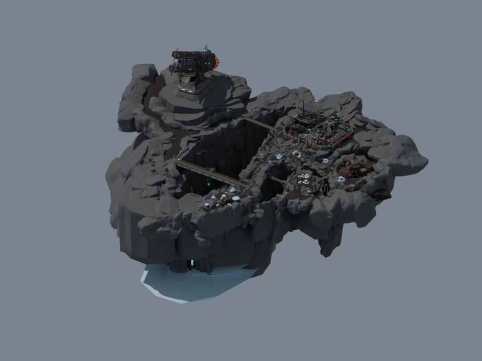
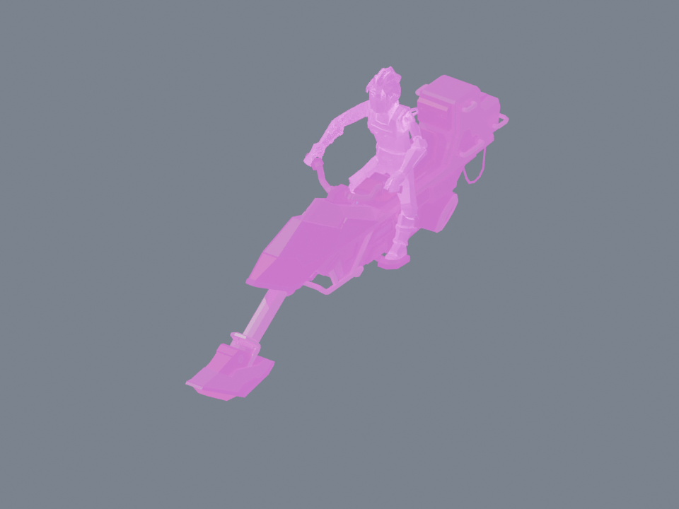
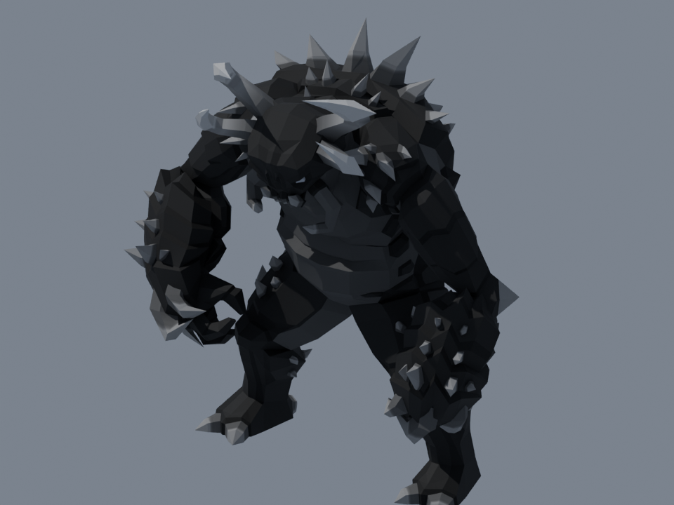

# Inspected asset ledger

Latest admission: `public/models/ridge-run-shell.glb` is the level-derived seven-mesh canyon/bridge/outpost shell (33,197 triangles; 2,629,384 bytes). Matching box collision is `public/mission/ridge-run-world.json`. `public/models/jetbike-hero.glb` is the separate 1,567,028-byte replacement-material study, now active with seated animation. Full scene and render are `art/ridge-run/ridge-run.blend` / `ridge-run-scene.png`; source models remain unchanged. These admissions supersede the pending-runtime decisions in the original inspection table. Licensing is still unverified.

2026-09-13 Windows inspection using Blender 5.2.1 LTS. Reproduce with `blender --background --factory-startup --python scripts/inspect-models.py`. Source SHA-256, exact byte sizes, imported bounds, materials and animation names are in `art/inspection/<name>.json`; actual renders are adjacent PNGs. Supplied originals remain unchanged. Commercial provenance is **unverified for every supplied model**; names resembling an asset pack do not prove a license.

| Source | What the render shows | Blender triangle total | Design decision |
|---|---|---:|---|
| level1.glb | Faceted basalt crater, two narrow bridges, isolated elevated tower, dense industrial outpost, cyan machinery accents | 1,169,700 | Extract bridge/chasm/outpost motifs for a small route; keep full scene offline |
| level1_navmesh.glb | Disconnected-looking ground patches and narrow bridge strips | 11,999 | Rebuild/alignment-check only the chosen ground route; not player collision |
| enemy.glb | Broad spiked rock humanoid | 6,000 | Ground Warden with named idle/attack/death states; no invented bike-rival animations |
| avi.glb | Stylized armored humanoid | 3,708 | Optional briefing character; defer from first playable |
| jetbickavi.glb | Rider on long ski-nose hoverbike; magenta material failure | 8,843 | Keep procedural runtime bike pending material, bounds, animation and camera checks |
| gun.glb | Gray/blue angular science-fiction rifle | 1,221 | Texture-heavy rather than triangle-heavy; reduce textures before mounted-weapon study |

Triangle totals sum imported mesh objects, including repeated geometry instances and any source helper geometry. They are not unique glTF mesh counts or measured visible browser triangles. This supersedes ambiguous older claims of about 355k triangles for the full city. Blender imports 2,292 mesh objects out of 2,298 objects; the source glTF's 393 mesh definitions describe a different count. Bounds are Blender Z-up world bounds at import time, not normalized gameplay units or animation-wide bounds.

## Actual visual evidence

The city composition supports a high exposed bridge and low sheltered chasm, reconverging at a Warden yard before extraction. This is a design interpretation of the rendered assets, not an existing mission. Matching the warm Mars concept requires material/lighting work: the source render is mostly dark gray. Avoid bringing all outpost dressing into the first mission.

## Bike repair study

`scripts/repair-bike.py` creates `art/staging/jetbike-material-study.blend`, `.glb` and a JSON provenance receipt. The original has two images that Blender cannot decode (zero dimensions), including an invalid PNG stream. The study removes broken texture nodes, supplies a matte rust fallback for missing base color, clears orphaned emission, and reduces the valid 4096 texture to 1024.

Export is 1,567,028 bytes. This replaces missing appearance; it does not reconstruct the artist's lost texture. The first export had excessive white emission; visual review in [Don McCurdy's viewer](https://gltf-viewer.donmccurdy.com/) caught it, and a second export corrected it. Final viewer inspection shows a gray/red bike with a copper-colored rider, not magenta. A viewer warning remains to triage; do not label this fully validated or runtime-ready. Runtime admission, animated bounds, sockets, camera occlusion and commercial rights remain open.

## Art handoff

Open the study `.blend` to repaint the rider, inspect normals, set a consistent real-world scale, and preview the action. Export selected asset objects as GLB with Y-up, using the installed exporter options. Verify the result in the independent viewer and actual A-Frame 1.4 runtime before adding it to the production asset allowlist. Author route visuals, player/projectile proxies, ground navigation and mission markers separately; never use visual triangles as the implicit collision contract.
