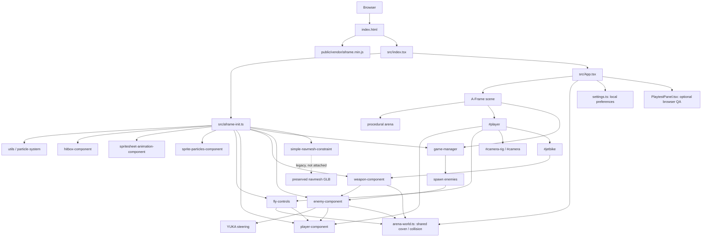
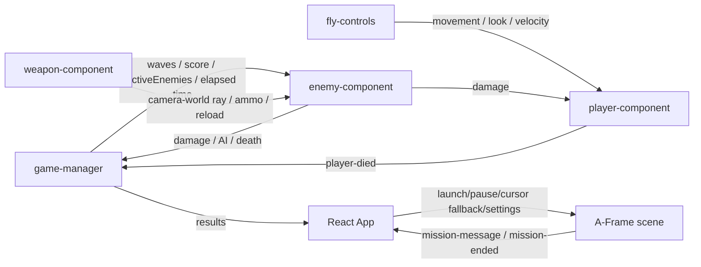
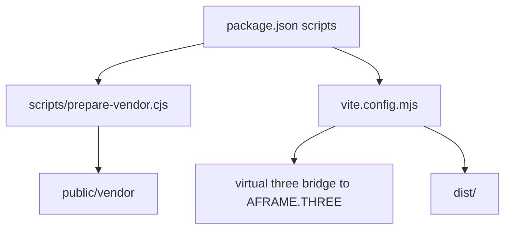
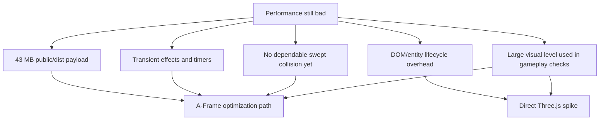

# Project graph

Generated from the current repository on 2026-09-13. This graph distinguishes the active Red Horizon runtime from legacy/demo files that are still present in the repo.

## Active runtime

## Gameplay ownership

## Build and vendor flow

## Active versus legacy

```mermaid
flowchart TD
  Active["Active path"]
  Legacy["Legacy/demo path"]

  Active --> A["index.html"]
  Active --> B["src/index.tsx"]
  Active --> C["src/App.tsx"]
  Active --> D["src/aframe-init.ts"]
  Active --> E["src/components/fly-controls.ts"]
  Active --> F["src/components/player-component.ts"]
  Active --> G["src/components/weapon-component.ts"]
  Active --> H["src/components/enemy-component.ts"]
  Active --> I["src/components/game-manager.ts"]
  Active --> J["src/components/simple-navmesh-constraint.ts"]
  Active --> K["tests/gameplay.test.cjs"]

  Legacy --> L["public/index.html"]
  Legacy --> M["src/demo-scene.ts"]
  Legacy --> N["src/components/custom-fly-controls.ts"]
  Legacy --> O["firework / particle demo components"]
  Legacy --> P["public/images/demo/*"]
  Legacy --> Q["public debug scripts"]
```

## Current pressure points

## Next graph targets

- Add a measured performance graph after Day 0 from `docs/REVAMP_PLAN.md`.
- If the Three.js spike starts, add a second graph for `src/three-game/` and compare it against this A-Frame graph.
- Remove legacy/demo nodes from production packaging once asset cleanup starts.
